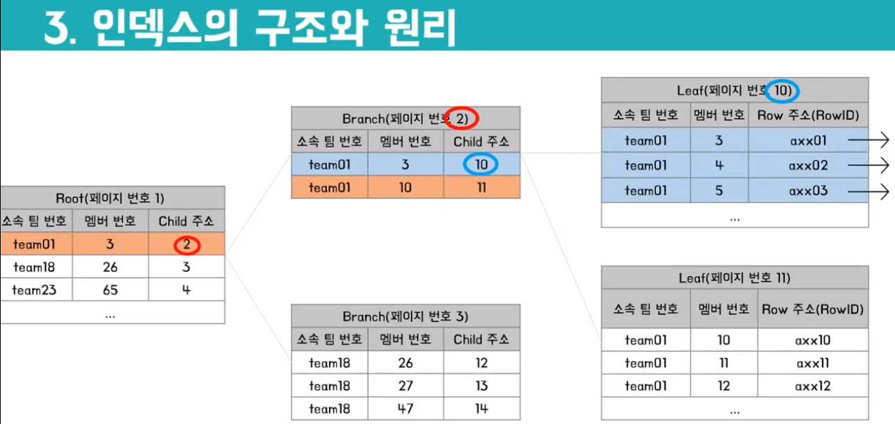
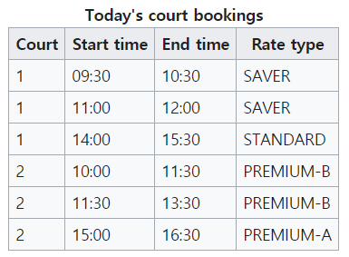
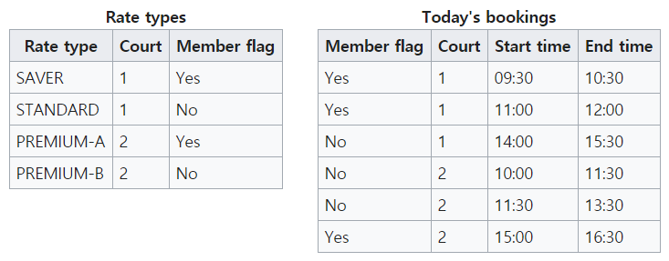
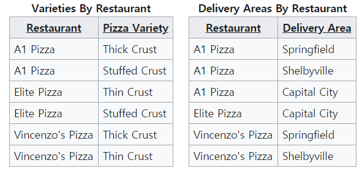

# DB

데이터베이스 기초부터 심화까지


참고서적

- Do it! 오라클로 배우는 데이터베이스 입문
- Database System Concepts [pdf](https://www.db-book.com/db7/index.html)
  - SNUON 강의 "데이타베이스: 빅데이터 시대의 필수 정보관리 개론" - 이상구
- Softbank 신입사원 OJT


[TOC]

## **1. 데이터베이스 개론**

> 데이터베이스 기본 개념


데이터베이스란?

- 데이터와 정보
  - 데이터: 어떤 필요에 의해 수집했지만 아직 특정 목적을 위해 평가하거나 정제하지 않은 자료
  - 정보: 수집한 데이터를 어떤 목적을 위해 분석하거나 가공한 것
- 효율적인 데이터 관리: **데이터베이스의 필요성** 대두
  - 데이터를 통합하여 관리
  - 일관된 방법을 관리
  - 데이터의 누락, 중복 제거
  - 여러 사용자가 공동으로 실시간 사용 가능
- 데이터베이스
  - 특정 목적을 위해 여러 사람이 공유하여 사용할 수 있으며 효율적 관리와 검색을 위해 **구조화한 데이터 집합**
- 파일 시스템
  - DB등장 이전에 데이터를 관리하던 방식
  - 각각의 응용 프로그램에 필요한 데이터를 각각 저장: 중복 및 누락 발생 가능
    - 데이터의 통합 관리 필요성 대두: **DBMS**의 등장


DBMS란?

- Database Management System
- 여러 목적으로 사용할 데이터의 접근/관리 등 업무를 **DBMS가 전담**함
  - 하나의 DBMS를 통해 관리: 데이터를 관리하는 방식이 통합됨
  - 중복 및 누락 방지: 하나의 소프트웨어가 데이터를 관리
  - 공동으로 실시간 사용 가능: 데이터가 응용프로그램에 독립적이므로 프로그램 업데이트 시에도 사용 가능


데이터 모델

- 데이터를 저장하는 방식을 정의해 놓은 개념 모형

- 계층형 데이터 모델

  - 트리 구조를 활용
  - 부모 자식 관계 - 1:N

- 네트워크형 데이터 모델

  - 그래프 구조를 기반으로 함
  - 자식 개체가 여러 부모 개체를 가질 수 있음 - M:N

- 객체 지향형 데이터 모델

  - 데이터를 독립된 개체로 구성하여 관리

- **관계형 데이터 모델**

  - 데이터 간 관계에 초점

    - 각 데이터의 **독립 특성**만을 규정하여 데이터 묶음을 나눔
    - 중복이 발생할 수 있는 데이터는 별개의 **relation**으로 정의하여 연결

  - 구성 요소

    - | 이름                   | 설명                                   | 대응(구현)되는 개념  |
      | ---------------------- | -------------------------------------- | -------------------- |
      | 개체(entity)           | 데이터화하려는 사물/개념의 정보 단위   | 테이블(**relation**) |
      | 속성(attribute)        | 데이터의 종류, 특성, 상태              | 열(column)           |
      | **관계(relationship)** | 개체 간 또는 속성 간의 연관성을 나타냄 | 외래키               |

  - **릴레이션(relation)과 관계(relationship)의 차이** [링크](https://m.blog.naver.com/PostView.nhn?blogId=ej5811&logNo=80191263951&proxyReferer=https:%2F%2Fwww.google.com%2F)

    - 릴레이션: 집합x와 집합y 사이에 관계 R을 만족하는 모든 순서쌍
      - 테이블이 집합 간의 cartesian product를 생성한다는 것을 생각해보자
      - 집합이론에서는 relation, 논리 데이터 모델링에서는 entity, 관계형 데이터베이스에서는 table
    - 관계: 하나 또는 두 개의 entity type으로부터 **업무적인 이유**에 의해 entity가 연결되어 있는 **페어링의 집합**
      - 예) entity type "주문"의 entity인 "주문번호"가 entity type "주문상품"의 entity인 "상품코드"와 연결되어 페어링을 이루고 있음
      - 페어링은 관계의 멤버이고, 관계는 페어링의 집합체


### 1.1. 관계형 데이터 베이스


관계형 데이터베이스

- 관계형 데이터 모델을 바탕으로 만들어진 데이터베이스
  - 테이블(table)로 이루어져 있으며, 이 테이블은 키(key)와 값(value)의 **관계**를 나타냄
- 관계형 데이터베이스를 관리하는 시스템은 **RDBMS**(Relational Database Management System)이라 함
  - MS-SQL, MySQL, MariaDB, PostgreSQL, DB2 등


SQL

- Structured Query Language
- RDBMS에서 데이터를 다루고 관리하는 데 사용하는 **질의 언어**
  - 조회, 데이터 조작, 객체 조작 등
  - DQL(Data Query Language)
    - 데이터를 원하는 방식으로 조회하는 명령어
  - DML(Data Manipulation Language)
    - 데이터를 저장, 수정, 삭제하는 명령어
  - DDL(Data Definition Language)
    - 테이블을 포함한 여러 객체를 생성, 수정, 삭제하는 명령어
  - TCL(Transaction Control Language)
    - 트랜잭션 데이터의 영구 저장, 취소 등과 관련된 명령어
  - DCL(Data Control Language)
    - 데이터 사용 권한과 관련된 명령어


관계형 데이터베이스의 구성 요소

- 테이블
  - 2차원 표 형태의 데이터 저장 공간
  - 행: 저장하려는 **하나의 개체를 구성하는 여러 값**을 가로로 늘어뜨린 것
  - 열: 저장하려는 데이터를 **대표하는 이름과 공동 특성**
- 키
  - 수많은 데이터를 구별할 수 있는 유일한 값
  - **기본키**
    - 저장된 행을 식별할 수 있는 유일한 값
    - 값이 중복되지 않아야 함
    - NULL값을 가질 수 없음
    - 보통 후보키 중에 **개인 정보 노출이 가장 적은 데이터를 선정함**
  - 보조키
    - 후보키 중에 기본키로 지정되지 않은 값: 속성은 기본키와 같음
  - 외래키
    - 특정 테이블에 포함되어 있으면서 다른 테이블의 기본키로 지정된 키
    - 예) 학생 정보 테이블에 있는 학과 코드: 학과 정보 테이블과 학생 정보 테이블을 이어줌
  - 복합키
    - 여러 열을 조합하여 기본키 역할을 할 수 있게 만든 키
    - 예) 과목 정보 테이블에서 (과목코드+교수+강의시간) 조합으로 수업을 유일하게 식별함 


오라클 데이터베이스

- 대표적인 상용 관계형 데이터베이스 제품
- 자료형
  - 여러 자료형이 있지만 보통 **VARCHAR2, NUMBER, DATE** 세 가지만을 사용함
- 객체
  - 테이블: 데이터를 저장하는 장소
  - 인덱스: 테이블 검색 효율을 높이기 위해 사용
  - 뷰: 데이터를 논리적으로 연결하여 하나의 테이블**처럼** 사용하게 해줌
  - 시퀀스: 일련 번호를 생성해 줌
  - 시노님: 오라클 객체의 **별칭**을 지정함
  - 프로시저: 프로그래밍 연산 및 기능 수행, return 값 없음
  - 함수: 프로그래밍 연산 및 기능 수행, return 값 있음
  - 패키지: 관련 있는 프로시저와 함수를 보관함
  - 트리거: 데이터 관련 작업의 연결 및 방지 관련 기능 제공
- PL/SQL
  - SQL과 별도로 데이터 관리를 위해 만들어진 프로그래밍 언어
  - 프로그래밍 언어에서 제공하는 요소를(변수, 조건문, 반복문) 사용하여 데이터를 관리할 수 있음


### 1.2. NoSQL

> Not only SQL
>
> 비 관계형 데이터베이스 : 행과 열로 이루어진 테이블 형식 스키마를 사용하지 않는 DB를 통칭함


RDBMS vs NoSQL

- 관계형 데이터베이스
  - 장점
    -  트랜잭션을 통한 안정적인 데이터 관리
  - 단점
    - 데이터를 처리하는 데 필요한 비용의 증가로 빅데이터 처리가 어려움
    - 관계형 모델과 메모리 내 데이터 구조 간 데이터 불일치 : ORM을 통해 해결할 수 있음
- 비관계형 데이터베이스
  - 장점
    - 확장성 : **JOIN 처리가 없**기 때문에 스케일 아웃을 통한 노드 확장이 용이함
    - 유연성 : 가변적인 데이터구조로 데이터를 저장할 수 있음
  - 단점
    - 다양하고 복잡한 쿼리가 불가능함
    - 일관성을 항상 보장할 수 없음


ORM이란?

- 객체와 데이터베이스의 데이터를 매핑해주는 것 : 객체 간의 관계를 바탕으로 **SQL을 자동으로 생성**
  - 객체 모델(클래스)과 관계 모델(테이블)간의 불일치를 해소해 줌
  - 프로그램에서 객체를 DB에 저장할 때 Object Persistence를 만드는데, 다음과 같은 방법을 활용함
    - JDBC를 이용해 직접 persistence layer를 구현
    - **Persistence framework**(SQL Mapper, ORM)을 사용
- SQL Mapper와의 차이
  - Mapper의 경우 개발자가 직접 SQL을 작성하여 데이터를 매핑시키도록 함
  - 세부적인 SQL 변경 시 편리하다는 장점이 있음
  - 대표적인 Mapper로 Mybatis가 있음
- ORM의 종류
  - Java : JPA, Hibernate
  - Node.js : Sequalize
  - Django : 내장 ORM
- 장점
  - 코드의 재사용성 및 가독성이 향상 : SQL문이 아니라 메서드를 이용하여 데이터를 조작할 수 있음
  - 객체 지향적인 접근으로 생산성을 올릴 수 있음
  - DB의 종류별 종속성을 줄이고 호환성을 높일 수 있음
- 단점
  - 구현이 어려움 : 설계가 복잡하고, 잘못 구현되면 일관성이 무너질 수 있음
  - **프로시저**가 많은 시스템에선 ORM의 객체 지향적인 장점을 활용하기 어려움
    - 특정 작업을 위한 프로그램의 일부로 함수와 같은 의미


NoSQL의 종류

- Aggregate-oriented Model
  - 집합 지향 모델은 분산 시스템에서 사용하기 적합하며 **JOIN 연산이 불가능**
    - 이를 지원하기 위해 MongoDB 등에서는 **Map Reduce**를 제공함
  - Key-value
    - 데이터를 key-value pair로 저장하는 DB
    - 수평적 확장이 용이하고 API가 간단함
    - **value의 내용을 사용한 쿼리가 불가능**함
    - Redis, Amazon Dynamo DB, LevelDB 등이 있음
  - Document
    - 데이터를 key-document pair로 저장하는데, document는 계층적 구조를 가짐
    - **document 내의 item을 활용한 쿼리가 가능**함
    - ORM이 필요하지 않음 : 애초에 객체의 형식을 갖고 있기 때문
    - Mongo DB, Couch DB 등
  - Column-family
    - key가 row(키 값), column-family, column-name으로 구성됨
    - key에서 필드를 결정 : 질의는 row, column-family, column-name을 통해 수행
    - **클러스터링**이 쉽게 이루어짐 : 
    - HBase, Cassandra 등
- Graph Model
  - 개체와 관계를 그래프 형태로 표시 : 데이터는 연속적인 노드, 관계, 특성의 형태로 저장됨
  - 데이터 간의 관계가 탐색의 키인 경우에 적합함
    - SNS에서 친구의 친구를 찾는 기능에 최적화됨
    - 연관된 데이터를 추천해주는 추천 엔진이나 패턴 인식 등에도 적합함
  - ACID 트랜잭션을 지원함
  - 클러스터링에는 적합하지 않음


### 1.3. 인덱스


인덱스란?

- 추가적인 쓰기 작업과 저장공간을 활용하여 DB 테이블의 **검색 속도를 향상시키기 위한 자료구조**
  - 특정 column에 대해 해당 컬럼의 데이터와 인덱스 주소를 매핑해 따로 저장함
  - 내부적으로는 B-Tree, B+Tree 또는 해시테이블을 활용하여 만들어짐
  - 해시 테이블은 등호 연산에만 특화되어있기 때문에 B-Tree나 B+Tree가 사용되는 것이 일반적
    - DB는 부등호 연산이 보통 : 조회할 값을 특정하기보다 범위로 찾는 경우가 많기 때문에
- **Full Table Scan**
  - DB에서는 조회 요청이 들어올 때 테이블의 **모든 데이터를 검색**함
  - 데이터의 수가 늘어날 수록 검색이 느려지기 때문에 공간을 다소 희생해서 속도를 높이는 것
    - 인덱스는 데이터 외의 공간에 저장되고, 통상 10%정도를 추가로 필요로 함


인덱스의 구조와 원리

- 인덱스는 항상 정렬된 상태로 유지되어야 함
- 인덱스는 **Range scan**을 함
  - key column 순으로 정렬시켜두고 특정값을 찾다가 해당 범위를 넘는 값을 만나면 **멈춤**
  - 예) 5번 멤버를 찾기 위해 5번 이하의 멤버를 타고 리프까지 내려간 후 탐색하다 5번을 만나면 stop
  - 
  - Full table scan의 경우 원하는 값을 찾아도 뒤에 또 있을 수 있으니(정렬되지 않아서) 계속 찾음
- 인덱스는 메인 메모리에 저장됨
  - 메모리 상에서 페이지 단위로 관리됨
  - DB의 Storage System 내부 Page Buffer Manager가 페이지를 관리함


인덱스를 사용해야 하는 경우

- **Cardinality**가 높은 column에 인덱스를 적용한다
  - 여러 튜플들이 다 다른 값을 가질 때 cardinality가 높음
  - 성별이나 수강 과목 같은 경우 여러 튜플들이 동일한 값을 갖고 있으므로 cardinality 낮음
  - 같은 인덱스가 적용된 데이터가 많으면 결국 디스크로 가서 다시 탐색해야 해서 속도 향상이 적음
- SELECT문의 WHERE, JOIN이 자주 사용되는 경우
- INSERT, UPDATE, DELETE 등 데이터 수정이 적게 일어나는 경우
  - INSERT
    - 인덱스는 정렬된 상태로 존재하기 때문에 중간에 새 데이터가 들어온다면 하나씩 밀어줘야 함
    - 최악의 경우 Leaf Block이 꽉 차서 데이터를 다른 블록으로 옮겨야 하기도 함
  - DELETE 
    - 인덱스 테이블에서는 데이터를 삭제하지 않고 사용하지 않음 표시만 함
    - DELETE가 빈번하게 일어나면 금방 자리를 다 차지하고, 최악의 경우 원본보다 인덱스가 길어짐
  - UPDATE
    - 인덱스는 데이터를 변경하지 않음
    - DELETE로 사용 안 함 처리를 한 후 INSERT하기 때문에 부하가 큼


인덱스의 종류

- Clustered
  - 순서대로 데이터를 정렬 : 범위 검색에 강점이 있음
  - 테이블마다 단 하나만 존재할 수 있음
  - 새로 저장하면 뒤에 있는 데이터를 하나씩 다 밀어줘야 함
  - PK가 여기에 해당함
- Non-Clustered
  - 순서와 상관없이 데이터의 주소값만 저장
  - 한 테이블에 여러개가 존재 가능
  - INSERT시 추가 저장 공간이 필요
  - 일반적으로 인덱스라고 하면 이걸 말함


## **2. DQL**

> SELECT 문을 이용하여 데이터베이스를 조회, 분석하기


데이터를 조회하는 3가지 방법

- SELECTION
  - **행 단위**로 원하는 데이터를 조회
- PROJECTION
  - **열 단위**로 원하는 데이터를 조회
  - SELECTION, PROJECTION을 함께 사용하여 상세하게 조회할 수도 있음
- JOIN
  - **두 개 이상의 테이블을 연결하여 하나의 테이블처럼 조회**
  - SELECT문을 사용할 때 자주 사용됨


### 2.1. SELECT문의 기본 형식


`SELECT [조회할 열1 이름], [열2], ..., [열N] FROM [조회할 테이블 이름];`

- 조회할 열 이름에 `*`를 넣으면 전체 열 조회 가능: `SELECT * FROM EMP;`
- 띄어쓰기와 줄 바꿈 활용
  - 명령 수행에 영향을 주지 않기 때문에 가독성을 위해 **SELECT와 FROM을 다른 줄에 적는 것 권장**


중복 제거

- DISTINCT를 이용하여 중복을 제거하고 특정 데이터 종류만 확인 가능

- ```SQL
  SELECT DISTINCT DEPTNO
  	FROM EMP;
  ```

- ALL을 이용하면 반대로 중복을 제거하지 않고 그대로 출력함

- ```SQL
  SELECT ALL DEPTNO
  	FROM EMP;
  ```


정렬

- ORDER BY를 사용하여 출력 데이터를 정렬함

- SELECT문의 제일 마지막에 `ORDER BY [정렬하려는 열(여러 개 가능)] [정렬 옵션]` 을 붙여 사용

  - 정렬 옵션은 ASC(기본 값), DESC 존재

  - ```SQL
    SELECT *
    	FROM EMP
    ORDER BY SAL;
    ```

  - 여러 개 조건을 붙이면 먼저 오는 열을 우선 정렬하고 값이 같으면 그 다음 열 기준으로 정렬

    - `ORDER BY DEPTNO DESC, ENAME;`

- 정렬은 느리기 때문에 **가능하면 사용하지 않을 것**을 권장


별칭 설정

- SELECT 절에 명시한 열 이름이 아니라 별칭이(alias) 출력되도록 할 수 있음

  - 편의를 위해 + 해당 열이 어떻게 도출되었는지 노출되지 않기 위해 사용함

- **별칭을 하나씩 지정**하는 방법과 **연산식을 사용**하는 방법 존재

  - 연산식을 사용하여 연수입 출력하기(월급*12 + 상여)

  - ```SQL
    SELECT ENAME, SAL, SAL*12+COMM, COMM
    	FROM EMP;
    ```

  - 별칭을 지정하는 방법

    - 4가지가 있는데 보통 3번째를 많이 사용(한 칸 띄우기, 한 칸 띄우고 큰 따옴표, **한 칸 띄우고 AS**, 한 칸 띄우고 AS 다음에 큰 따옴표 )
    - `SELECT ENAME, SAL, SAL*12+COMM AS ANNSAL, COMM FROM EMP;`
    - SQL문에 따옴표 사용이 좋지 않기 때문: 프로그래밍 언어에서 문자열로 ("SQL") 사용 시 에러 발생


WHERE

- **특정 조건을 기준으로** 원하는 행을 출력

  - WHERE절에는 조건식이 들어감: 조건식이 참인 경우에만 출력

- FROM 다음에 WHERE 절을 이용함

  - ```SQL
    SELECT *
    	FROM EMP
    WHERE DEPTNO = 30;
    ```

  -  SQL문에서는 동등 연산자가 ==가 아니라 =임

- WHERE문과 함께 사용하는 연산자

  - **논리 연산자 AND, OR**을 이용하여 **여러 개의 조건식 적용도 가능**: 조건식 갯수는 무제한

    - 여러 개 조건식이 묶여 있을 때 NOT을 이용하여 한번에 뒤집는 경우 많음

  - **IN**을 이용하여 조건식 갯수를 줄일 수 있음

    - OR을 여러 개 사용한 경우

    - ```SQL
      SELECT *
      	FROM EMP
      WHERE JOB = 'MANAGER'
         OR JOB = 'SALESMAN'
         OR JOB = 'CLERK';
      ```

    - IN을 사용한 경우

    - ```SQL
      SELECT *
      	FROM EMP
      WHERE JOB IN ('MANAGER', 'SALESMAN', 'CLERK');
      ```

  - **BETWEEN A AND B**를 이용하여 조회하기

    - ```SQL
      SELECT *
      	FROM EMP
      WHERE SAL BETWEEN 2000 AND 3000;
      ```

  - 일부 문자열이 포함된 데이터를 조회할 때 사용하는 **LIKE**

    - ENAME 열 값이 대문자 S로 시작하는 데이터를 조회하라는 SQL문

    - ```SQL
      SELECT *
      	FROM EMP
      WHERE ENAME LIKE 'S%';
      ```

    - 와일드 카드: ( `%, _` ) 특정 문자 또는 문자열을 대체함

  - **IS NULL**을 이용해 데이터가 NULL인 행을 조회하기

    - ```SQL
      SELECT *
      	FROM EMP
      WHERE COMM IS NULL;
      ```

    - NULL은 비교 연산자로 비교하면 결과 값도 NULL이 되기 때문에 IS NULL을 이용해야 함

  - **집합 연산자**

    - 두 개 이상의 SELECT문의 결과 값을 연결함
    - 열 갯수와 각각의 열의 자료형이 일치해야(열 이름은 달라도 ok)연결 가능
    - UNION: 합집합으로 묶음, 중복 제거
    - UNION ALL: 합집합으로 묶고 중복 제거하지 않음
    - MINUS: 차집합 - 먼저 작성한 SELECT문의 결과에서 다음 결과를 빼 줌
    - INTERSECT: 교집합


### 2.2. JOIN


JOIN이란?

- 중복을 없애기 위해서 **정규화**한 테이블들에서 원하는 결과를 도출하기 위해 **다시 조합**하는 것
- 적어도 하나의 칼럼을 서로 공유하고 있는 테이블들을 연결하여 **데이터 검색에 활용**함
  - 보통 공통된 값인 PK 및 FK 값을 사용하여 JOIN
  - JOIN 연산자에 따라, From 절의 JOIN 형태에 따라서 구별함


JOIN의 종류

- 연산자에 따른 분류
  - EQUI JOIN : 두 테이블 간의 칼럼 값들이 서로 일치하는 경우(`=`연산자 사용)
  - NON EQUI JOIN : 두 테이블 간의 칼럽 값들이 일치하니 않는 경우(비교 연산자 사용)
- FROM 절의 JOIN 형태에 따른 분류
  - INNER JOIN : JOIN 조건에서 **값이 일치하는 행만** 반환
  - OUTER JOIN : JOIN 조건에서 **한쪽 값이 없더라도** 행을 반환
- 동작 방식에 따른 분류
  - JOIN이 어떤 방식으로 동작하고 있는지는 **실행계획**에서 확인 가능
    - 적절하지 않은 경우 오라클 힌트를 이용하여 변경 가능
  - NESTED LOOP JOIN : 중첩 for문과 같은 방식으로 **JOIN 조건을 반복적으로 체크**하면서 수행
    - INNER TABLE의 INDEX를 이용하지 않으면 굉장한 비효율이 발생함
    - 1:N관계를 가지는 경우 1인 쪽이 OUTER TABLE로 설정되는 것이 좋음 
    - 예)걸그룹 테이블과 멤버 이름 테이블을 그룹명 기준으로 JOIN할 때 그룹을 기준으로 멤버 이름 테이블을 scan하면서 멤버 이름을 가져와야 함
  - SORT MERGE JOIN : 두 테이블을 각각 JOIN 컬럼 기준으로 sort한 후 JOIN을 수행
    - INNER TABLE에 적절한 INDEX가 없어서 NESTED LOOP JOIN을 사용하기 비효율적인 경우에 이용
    - 범위로 JOIN을 하는 경우에도 (NON EQUI JOIN) 적절함
    - sorting은 PGA영역에서 수행됨 : 경합이 발생하지 않아 성능 상 이점이 있음
  - HASH JOIN
    - OUTER TABLE을 **Build Input**으로 삼아서 Hash 영역에 저장하고, INNER TABLE의 JOIN 컬럼을 기준으로 해시 함수를 적용하여 해시 테이블을 탐색하면서 JOIN을 수행
    - EQUI JOIN만 가능함
    - INNER TABLE이 대용량이고 OUTER TABLE이 작을 때(Hash영역 크기 제한) 좋음
    - 해시 키 값으로 사용되는 컬럼에 중복이 적어야 함
    - 배치에서 쓰면 좋음


#### INNER JOIN


EQUI JOIN

- 기준 테이블과 JOIN할 테이블의 **칼럼 값들이 서로 정확하게 일치하는 경우** 겹치는 값들을 가져오는 것

- WHERE 절에 `=`  동등 연산자를 사용하여 JOIN 조건을 명시

- 일반적으로 PK, FK로 지정된 칼럼을 JOIN으로 많이 사용함

- EQUI JOIN의 성능을 높이려면 **INDEX 기능을 사용하는 것이 좋음**

  - 조건이 일치하는지 확인하기 위해 매번 FULL SCAN을 하면 굉장히 비효율적이기 때문

- 예) 테이블 A와 B에서 각각 이름과 나이를 가져옴 

  - ```sql
    SELECT A.NAME, B.AGE
    FROM EX_TABLE A
    EQUI JOIN JOIN_TABLE B		--EQUI JOIN을 INNER JOIN으로 변경 가능
    ON A.NO_EMP = B.NO_EMP
    ```

  - 사원 번호가 같은 사람에 대해 조회 : 사원 별 나이-이름 테이블이 된다


NATURAL JOIN

- EQUI JOIN에서 동일한 속성이 두 번 나타나게 되는데, **중복을 제거하여 같은 속성을 한번만 표기**하는 것

- 두 테이블의 **동일한 이름을 가지는 칼럼이 모두 JOIN됨**

  - ```sql
    SELECT A.NAME, B.AGE
    FROM EX_TABLE A NATURAL JOIN JOIN_TABLE B
    ```

  - USING문을 사용하면 칼럼을 선택해서 JOIN할 수 있음

  - ```sql
    SELECT A.NAME, B.AGE
    FROM EX_TABLE A JOIN JOIN_TABLE B
    USING No_EMP;
    ```

- 테이블 별칭(alias)을 사용하면 오류가 발생함


NON EQUI JOIN

- 조인 대상 테이블의 **어떤 칼럼 값도 일치하지 않을 때** 사용하며 '=' 이외의 연산자를 사용

- 사용 빈도가 매우 낮다고 함

- 연산자 : BETWEEN AND, IS NULL, IS NOT NULL, IN, NOT IN, < , >, >=, <=

- ```sql
  SELECT [테이블명1.]속성명, [테이블명2.]속성명 ....
  FROM 테이블명1, 테이블명2..
  WHERE (NON EQUI JOIN 조건)	--JOIN 키워드는 안 쓰고 그냥 조인함
  ```


SELF JOIN

- **같은 테이블 내에서** 2개의 속성을 연결하여 EQUI JOIN을 하는 것

  - 주의할 점 : JOIN할 때 **별칭을 반드시 입력**해주어야 함

- 한 테이블 내에 이미 종속 관계가 있을 때 사용(학번 - 학생 이름 - 선배의 학번)

- ```sql
  SELECT a.S_NO AS 학번, a.S_NAME AS 이름, b.S_NAME AS 선배
  FROM STUDENT a, STUDENT b
  WHERE a.S_SENIOR = b.S_NO;
  ```


#### OUTER JOIN


LEFT OUTER JOIN

- JOIN의 왼쪽에 표기된 데이터를 기준으로 OUTER JOIN을 수행함

- 예) 학생 테이블과 학과 테이블에서 학과 코드 값이 같은 튜플을 JOIN하여 출력

  - ```sql
    SELECT s.S_NO, s.S_NAME, s.D_CODE, d.D_NAME
    FROM STUDENT s LEFT OUTER JOIN DEPARTMENT d
    ON s.D_CODE = d.D_CODE;
    ```

  - INNER JOIN과 달리 **학과 정보가 NULL인 학생도 출력됨**


RIGHT OUTER JOIN

- JOIN의 왼쪽에 표기된 데이터를 기준으로 OUTER JOIN을 수행함

- LEFT OUTER JOIN이랑 다른 것은 위치 뿐이니 위 예제를 다른 문법으로 해보자

  - ```sql
    SELECT s.S_NO, s.S_NAME, s.D_CODE, d.D_NAME
    FROM STUDENT s, DEPARTMENT d
    WHERE s.D_CODE(+) = d.D_CODE;	--LEFT OUTER JOIN의 경우 오른쪽에 (+)를 붙이면 됨
    ```

  - 이번엔 학생이 없는(학생 정보가 NULL인 학과)도 출력됨


FULL OUTER JOIN

- LEFT OUTER JOIN과 RIGHT OUTER JOIN의 결과를 합집합으로 처리한 결과와 동일함

- LEFT, RIGHT OUTER JOIN과 다르게 JOIN을 명시하는 경우만 가능

  - ```sql
    SELECT s.S_NO, s.S_NAME, s.D_CODE, d.D_NAME
    FROM STUDENT s FULL OUTER JOIN DEPARTMENT d
    ON s.D_CODE = d.D_CODE;
    ```

  - 학과코드가 입력 안 된 학생이나 학과명이 없는 학과코드도 모두 출력됨


CROSS JOIN

- Cartesian Product라고도 하며 곱집합을 반환함

- 두 테이블 간에 연결될 수 있는 모든 경우의 수를 산출하여 나타내는 JOIN

- ```sql
  SELECT A.COLOR, B.SIZE
  FROM EX_TABLE A
  CROSS JOIN JOIN_TABLE B
  ```


### 2.3. 정규화


데이터베이스 이상(**anomaly**)이란?

- 잘못된 테이블 설계로 인해 **데이터의 중복이 발생하여 생길 수 있는 부작용**을 이상이라 함
  - 이상은 **정규화가 되어있지 않기 때문**에 발생함
  - 이상을 해결하기 위해서 속성들 간의 관련성을 파악해서 정규화를 해주어야 함
- 삽입 이상
  - 신규 데이터를 삽입하기 위해 불필요한 데이터를 함께 삽입해야 하는 경우
  - 예) 학번+과목명을 PK로 갖는 수강 과목 테이블에서 한 과목도 안 듣는 학생을 삽입할 때
    - PK는 null값을 가질 수 없기 때문에 "미수강" 항목을 추가로 만들어서 넣어줘야 함
- 갱신 이상
  - 중복되는 데이터 중 일부만 변경하여 데이터의 불일치가 발생하는 문제
  - 예) 3과목을 수강하는 학생의 과를 변경할 때 1개만 변경하면 해당 학생의 과가 무엇인지 모르게 됨
- 삭제 이상
  - 어떤 튜플을 삭제할 때 삭제가 되지 않아야 할 데이터도 같이 지워지는 문제
  - 예) 한 과목만 수강하는 어떤 학생이 수강 취소했을 때 해당 학생의 모든 정보가 지워짐


함수적 종속성(Functional Dependency)이란?

- 어떤 릴레이션 R의 속성 X, Y가 있을 때, 다음 상황에서 **Y는 X에 함수적 종속**이라고 함
  - X의 값을 알면 Y의 값을 식별할 수 있고
  - X의 값이 변화함에 따라 Y의 값이 달라짐
- 완전 함수적 종속성(Full Functional Dependency)
  - Y가 **속성 집합 X 전체에 대해서만 함수적 종속**이 되는 경우
  - 예) 위 예시에서 학점은 학번+과목명 전체에 대해서만 종속이고 둘 중 하나에 종속되진 않음
- 부분 함수적 종속성(Partial Functional Dependency)
  - Y가 **속성 집합 X의 일부에 대해서도 함수적 종속**이 되는 경우
  - 예) 위 예시에서 이름, 학과는 학번+과목명 전체에 대해서도, 학번에도 종속임


정규화와 반정규화

- 정규화 데이터베이스
  - 중복을 최소화하도록 설계된 테이블
  - 트랜잭션이나 CRUD가 많이 일어나는 경우에 사용(**OLTP**)
    - On-Line Transaction Processing
  - 저장 공간 최소화, 안정성/무결성 유지, 이상 현상 제거라는 장점 있음
- 반정규화 데이터베이스
  - 개발이나 운영 상의 이슈로 인해 정규화된 **테이블을 역으로 합치는 경우**
    - 정규화된 테이블을 과다하게 JOIN하면 비용이 크기 때문에 의도적으로 정규화 원칙을 어김
  - 대량의 데이터를 읽고 처리하는 것이 중요한 경우에 사용(**OLAP**)
    - On-Line Analytical Processing
  - 빠른 조회가 가능하고 쿼리가 간단하여 버그 발생 가능성 낮다는 장점 있음


1NF


- 테이블은 **관계**여야 하며, 속성의 **원자성을 확보**하는 것을 제1정규형이라고 함
  - 각각 관계된 데이터 모임이 되도록 하기 위하여 분리된 테이블을 만들고 PK를 설정함
  - 도메인이 원자값이어야 함 : **중복되는 항목이 없어야 한다**
    - 여기에 NULL을 허용하지 않는 등 조건이 좀 추가될 수 있는데 이 정도만 알아두자
  - 예시에서 한 도메인에 여러 값이 들어가 있는데, 이를 다 나눠줘야 함 


2NF


- 후보 키 K와, K에 속하지 않는 속성 A가 있을 때, A를 결정하기 위해 K 전체를 참조해야만 하는 경우
  - 한 마디로 **1NF 테이블에서 부분 함수적 종속성을 제거**하면 2NF가 됨
  - 예) 기본키 학번+과목명에 대해 학과, 학비는 부분 함수적 종속성을 가짐(학번→학과, 학번→학비)
    - 학번, 과목명, 학점 테이블과 학번(PK), 학과, 학비 테이블 이렇게 2개로 분할하여 해결


3NF

- 2NF인 테이블에서 **모든 속성이 기본키에만 의존**하며, 다른 후보키에 의존하지 않는 경우
  - **이행적 함수 종속**(Transitive Functional Dependency)을 없애야 함
    - X→Y이고 Y→Z이면 X→Z이고, Z가 X에 이행적 함수 종속이라고 함
  - 예) 학번→학비는 사실 학번→학과, 학과→학비 이기 때문에 이행적 함수 종속임
    - 학번, 학과 테이블과 학과, 학비 테이블로 분할해주어야 함


BCNF(Boyce-Codd Normal Form)



- 3NF인 테이블에서 **모든 종속성**에 대해서 다음을 만족하면 BCNF이다

  - X→Y는 trivial functional dependency이다 (Y는 X에 포함되는 속성이다)
    - 예) {Employee_ID, Employee_Name} –> Employee_ID
  - X는 슈퍼키이다

- 예) 테니스 코트 예약을 받는 상황에서 예약 타입→코트 종속성이 있음

  - 예약 타입 SAVER는 회원이 코트1을 예약, STANDARD는 비회원이 1을 예약, PREMIUM-A,B도 회원/비회원이 코트 2를 예약하는 경우
  - 타입에 의해 코트 번호를 결정할 수 있는 종속성이 있으나 코트 번호는 타입의 부분집합이 아니고, 예약 타입은 슈퍼키가 아님
    - 예약타입 + 시작 시각 or 종료 시각을 해 줘야 유일성 확보 가능
  - Rate type을 PK로 가지고 Court, Member flag 속성을 갖는 Rate types table과 {Court, Start time}을 PK로 가지고 Member flag, End Time 속성을 갖는 Today's bookings table으로 분할하여 BCNF 정규화

  


4NF

- BCNF에서 **다치 종속**(multivalued dependency)을 제거하면 4NF이다

  - 의미적으로 상관없는 속성을 한 테이블에 표현하면, 같은 값을 여러번 입력해야하는 다치 종속이 발생함
  - 한 테이블에 X→Y와 X→Z 종속성이 있지만 Y, Z는 아무런 연관이 없는 경우
  - 예) 피자집, 피자 메뉴, 배달 가능 지역 : 메뉴와 지역은 피자집에 종속되나 이 둘은 관계가 없음

  


5NF

- 4NF에서 **조인 종속**을 제거하면 5NF이다

  - 조인 종속 : **어떤 릴레이션의 모든 속성이 슈퍼키**인 경우

  - 예) 개발자, 프로그래밍 언어, 자격증

    - 한 명의 개발자는 여러 언어를 가질 수 있고, 한 언어는 여러 개발자에 속할 수 있음
    - 한 자격증은 여러 개발자에 속할 수 있고, 한 개발자는 여러 자격증을 가질 수 있음
    - 한 언어는 여러 자격증에 속할 수 있고, 한 자격증은 여러 언어를 가질 수 있음

    


## **3. DML, DDL**


### 3.1. DML


### 3.2. DDL


### 3.3. 트랜잭션


트랜잭션이란?

- 하나의 그룹으로 처리되어야 하는 여러 **쿼리들을 묶은 작업의 논리적 단위**
  - 트랜잭션은 DML 쿼리들의 조합으로 구성됨
  - 예) 송금 트랜잭션 : 돈 보내는 사람의 잔고 UPDATE + 받는 사람의 잔고 UPDATE
  - 쿼리들을 논리적으로 그룹화하기 위해 **커밋**과 **롤백**이 이루어 짐
- 트랜잭션은 한 **작업의 완전성**을 보장함
  - 트랜잭션 내의 모든 처리대상 명령문들이 반드시 완전히 수행되어야 함
  - 어느 한 문장이라도 에러가 발생한다면 트랜잭션으로 묶인 전체 명령문은 모두 취소


트랜잭션의 성질 ACID

- Atomicity
  - 트랜잭션 중간에 어떠한 문제가 발생한다면 트랜잭션에 해당하는 어떠한 작업 내용도 수행되어서는 안되며 아무런 문제가 발생되지 않았을 경우에만 모든 작업이 수행되어야 함
- Consistency
  - 트랜잭션은 발생 전후에 **데이터의 일관성**을 보장해야 함
  - 데이터의 일관성 : 한 데이터를 서로 다른 장소에서 참조했을 때 조회 결과가 일치하는 것
- Isolation
  - 각 트랜잭션은 서로 간섭 없이 실행되어야 함
  - isolation이 보장되지 않으면 트랜잭션이 원래 상태로 되돌아갈 수 없음
- Durability
  - 트랜잭션이 종료되면 영구적으로 DB에 작업의 결과가 저장되어야 함
  - 이를 위해 트랜잭션 종료시 커밋 또는 롤백을 수행함


커밋과 롤백

- 트랜잭션을 논리적인 작업의 단위로 구분하기 위해  커밋과 롤백을 이용함
  - 이를 통해 **데이터 무결성**을 보장할 수 있음
- 커밋
  - 트랜잭션으로 묶인 모든 쿼리가 실행되어 성공하면 트랜잭션의 결과를 DB에 **영구적으로 저장**하는 작업
  - 영구적으로 변경하기 전에 데이터의 변경사항을 확인할 수 있음
  - DDL과 DCL 명령문이 수행되면 자동으로 커밋됨
- 롤백
  - 트랜잭션의 쿼리가 하나라도 실패하면 **실행 결과를 모두 취소하고 DB를 트랜잭션 실행 전의 상태로 되돌리는 것**
  - 컴퓨터가 다운되거나 SQL 프로그램이 비정상 종료되면 자동으로 롤백됨


트랜잭션의 복구

- UNDO
  - 사용자가 했던 작업을 반대로 진행하여 원상태로 되돌림
  - 롤백 작업 시에는 UNDO를 이용함
- REDO
  - 사용자가 했던 작업을 그대로 반복하여 진행
  - DB서버에는 기본적으로 모든 작업이 REDO에 기록됨 : 장애가 발생해도 안 날아감
- 장애 복구의 흐름
  1. REDO 데이터를 이용해서 마지막 Check point부터 장애까지의 버퍼 캐시를 복구
  2. UNDO를 이용해서 커밋되지 않은 데이터를 모두 롤백하여 복구 완료


데이터 무결성

- 데이터의 정확성, 일관성, 유효성을 유지하는 것
- 4가지 종류가 있음
  - 개체 **무결성** (Entity integrity) 
    - 모든 테이블이 기본 키 (primary key)로 선택된 필드 (column)를 가져야 함
    - 기본키로 선택된 필드는 빈 값을 허용하지 않음
  - 참조 **무결성** (Referential integrity) 
    - 서로 참조 관계에 있는 두 테이블의 데이터는 항상 일관된 값을 유지함
    - (참조되는 테이블의)기본키와 (참조하는 테이블의)참조키 간의 관계는 항상 유지되어야 함
    - FK의 값은 NULL이거나 참조하는 테이블의 PK 값 중 하나여야 함
  - 도메인 **무결성** (Domain integrity) 
    - 테이블에 존재하는 필드의 무결성을 보장하기 위한 것으로 올바른 데이터가 입력됐는지를 체크하는 것
    - 예) 성별 속성의 도메인은 남, 여로 그 외의 값은 입력 불가
  - **사용자 정의 무결성** 규칙 (User-defined Integrity)
    - 사용자가 정의한 무결성 규칙으로 개체, 참조, 도메인 무결성에 포함되지 않는 것


참조 규칙

- 참조되는 테이블에 변경이 있을 때 **참조 무결성을 지키기 위해** SQL에 설정되어 있는 규칙
  - 실수로 관련 데이터가 삭제되거나 수정되는 것을 막아줌
- 참조 무결성 강화 규칙으로 다음과 같이 5가지의 설정이 가능함
  - CASCADE
    - 참조되는 테이블의 레코드를 삭제할 때, 참조하는 테이블의 레코드가 **자동으로 삭제**됨
    - 참조되는 테이블의 기본 키 필드값이 바뀌면 참조하는 테이블의 필드값도 변경됨
  - RESTRICT
    - 참조하는 테이블에 일치하는 레코드가 있다면 참조되는 테이블의 레코드를 갱신/삭제할 수 없음
  - NO ACTION
    - 참조되는 테이블에 대해 갱신 또는 삭제를 했을 때, SQL문장 실행 종료 시에 FK 제약을 만족하는지 체크하고 만족하면 SQL문 실행이 성공, 아니면 실패하도록 함
  - SET NULL
    - 참조되는 테이블의 행이 갱신 또는 삭제되면 참조하는 테이블에서 대응되는 행의 FK 값이 NULL이 됨
  - SET DEFAULT
    - SET NULL과 동일한 경우에 FK 값이 NULL이 아니라 DEFAULT값이 됨


#### isolation level

여러 트랜잭션이 동시에 DB에 접근할 때 어떻게 제어할지에 대한 설정

- isolation level에 따라 **성능을 얻기 위해서 정합성을 얼마나 포기할 것인지** 정함
- 데이터 정합성과 성능(동시성)은 trade-off 관계를 가지고 있음
  - ACID를 엄격히 지키면 성능 저하
  - ACID를 완벽히 지키는 4레벨부터(Serializable) 지키지 않는 1레벨까지 4단계 존재함


Read-Uncommitted

- 트랜잭션이 커밋 되기 전에 데이터가 변경된 내용을 다른 트랜잭션이 조회 가능
- **Dirty Read**, Non-Repeatable Read, Phantom Read 발생 가능
  - 한 트랜잭션이 수정한 데이터를 다른 트랜잭션이 조회한 후 롤백이 일어난 경우
  - 무효가 된 데이터를 읽고 처리했기 때문에 문제가 생김


Read-Committed

- 커밋이 완료된 트랜잭션의 변경 사항만 다른 트랜잭션에서 조회 가능
- 아직 커밋되지 않았다면 변경 전 데이터를, 커밋됐다면 변경 후의 데이터를 읽음
- **Non-Repeatable Read**, Phantom Read 발생 가능
  - 한 트랜잭션에서 수정하고 커밋한 데이터를 다른 트랜잭션에서 커밋 이전과 이후에 각각 조회한 경우
  - 두 번의 조회에 대해 값이 다르다는 문제가 생김


Repeatable-Read

- 한 트랜잭션이 조회한 데이터는 항상 동일함을 보장
- 조회를 한 번 했으면 트랜잭션 종료시까지 다른 트랜잭션이 변경하거나 삭제 불가
- **Phantom Read** 발생 가능
  - 어떤 범위의 레코드를 읽었을 때 첫 번째 쿼리에선 없던 데이터가 새로 생긴 경우


Serializable

- 한 트랜잭션에서 사용하는 데이터를 다른 트랜잭션에서 접근 불가


## **4. DL/SQL**


## 5. DB 실무

실제로 서비스 개발에서 어떤 식으로 DB를 다루는지 OJT에서 배운 내용을 바탕으로 작성


### 5.1. JDBC

> Java Database Connectivity
>
> DBMS 종류에 상관없이 DB를 조작할 수 있기 위해 사용하는 Java API임


코딩의 흐름

JDBC 드라이버 로드 > DB 연결 > DB 조작(SQL) > DB 연결 종료


JDBC 드라이버 로드 [공식문서](https://jdbc.postgresql.org/documentation/81/connect.html)

- JDBC 드라이버란?
  - 각 DBMS에 맞는 클라이언트
  - DBMS 별 드라이버가 필요함(`.jar` 파일)
    - JDBC가 실제로 하는 일은 없고(API니까...) 드라이버가 일을 함
- `Class.forName("JDBC Name");` 으로 로딩함 
  - 드라이버의 클래스를 객체화하여 로드


DB 연결

- 드라이버 매니저를 통해 연결 객체 획득
  
  - 서버 + DB 이름 + user 이름 + password를 전달
  
  - ```java
    String server = "127.0.0.1";
    String database = "chess";
    String userName = "jonghoon";
    String pwd = "4512";
    
    Connection con = DriverManager.getConnection(url: "jdbc:mysql://" + server + "/" + database + "?");
    return con;
    ```


DB 조작

- **Preparedstatement** 혹은 Statement를 이용하여 **SQL문을 전달해 DB를 조작**할 준비를 함
  - cf) JPA의 경우 java app 내에서 SQL을 적을 필요가 없음
  - `PreparedStatement pstmt = con.prepareStatement(sql);`
    - Preparedstatement의 경우 ?를 이용하여 sql문에 원하는 데이터를 세팅할 수 있음
    - 동일하거나 비슷한 sql문을 반복적으로 실행하기 위해 사용됨: **Cache를 이용**함 → 성능 좋음
    - 처음 실행될 때만 연결 생성 - 컴파일 - 실행 3단계를 거치고 이후에는 ?의 값만 바꿔서 실행됨
  - `Statement st = con.createStatement();`
    - SQL문 수행 과정에서 매번 컴파일이 일어나기 때문에 성능 안 좋음
  - 여기서 con은 위에서 생성한 DB 연결 객체임
- DB 조작 실행: execute, executeQuery, executeUpdate
  - `pstmt.execute();`
    - boolean 타입의 값을 반환함: 리턴 값이 ResultSet인 경우엔 true, 그 외엔 false
  - `pstmt.executeQuery();`
    - ResultSet 객체의 값을 반환함: SELECT 구문을 수행할 때 사용됨
  - `pstmt.executeUpdate();`
    - Int 타입의 값을 반환함: SELECT 이외의 구문을 수행할 때 사용됨(반영된 레코드의 건수를 반환)


결과값 획득, 종료

