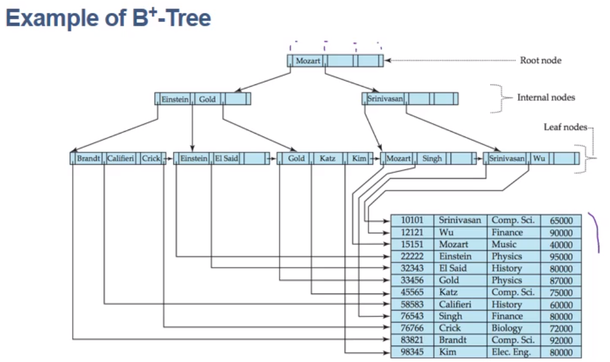

# Data Structure

>  데이터 단위와 데이터 자체 사이의 물리적 또는 논리적 관계


참고서적

- 윤성우의 열혈 자료구조
- 자료구조와 함께 배우는 알고리즘 입문 - Bohyoh Shibata
- 파이썬 알고리즘 인터뷰 - 박상길


이 문서는 C언어 기준으로 작성됨

Java에서 사용되는 자료구조는 Java 참조


[TOC]


## **1. 기본 자료구조**


### 1.1. 배열


배열이란?

- **같은 자료형**의 변수로 이루어진 요소가 모여 **직선 모양으로** 줄지어 있는 자료구조

  - ```c
    int arr[number of element];
    ```

  - 이 때 **요소의 갯수는 상수**만 사용 가능

    - 변수를 사용하면 런타임에 크기가 변화될 수 있음
    - **배열은 크기가 변하지 않는 자료구조**로 컴파일 타임에 크기가 결정됨

- 배열의 개별 요소에는 **인덱스**를 이용하여 접근


배열의 필요성

- 빠른 검색


### 1.2. 구조체


구조체란?

- 임의의 데이터를 다시 조합하여 만드는 자료구조

  - 클래스와 같은 개념
  - 임의의 데이터 타입들을 멤버로 가지는 **데이터의 묶음**
    - 어떤 객체가 갖는 데이터들을 각각 배열로는 관리하기 어렵기 때문에 묶어서 관리하는 것

- 구조체의 선언

  - ```c
    struct person{
        int		height;
        long	personID;
        double	vision;
    };
    ```

  - 중괄호 안의 멤버들을 모아 `struct person` 타입의 구조체를 새롭게 정의한 것 


구조체의 사용

- 멤버 접근

  - `objectName.meberName` : 객체 이름을 이용하여 멤버에 접근
  - `pointerName -> memberName` : 객체를 가리키는 포인터 이름을 이용하여 멤버에 접근

- typedef

  - 구조체의 이름 앞에는 반드시 struct가 따라와야 함: 번거로우니 typedef를 이용하여 동의어 선언

  - ```c
    struct person{
        ...
    }typedef P
    ```

  - 이걸로 `struct person` 을 `P`로 대체 가능


## **2. 스택과 큐**


### 2.1. 스택


스택이란?

- 데이터를 일시적으로 저장하기 위한 자료구조로, **후입선출**이라는 특징을 가짐
- 스택을 사용하는 곳
  - 프로그램에서 함수를 호출하고 실행할 때(Call Stack)
  - 문자열 역순 출력
  - 연산자 후위 표기법
- 보통 배열 또는 링크드리스트로 구현됨
- 데이터를 넣는 작업을 **push**, 꺼내는 작업을 **pop**이라 함
  - push, pop은 스택의 top에서 수행됨
  - 스택의 가장 밑바닥을 bottom이라 하고, 스택을 배열로 구현하면 `stk[0]`이 bottom이 됨
  - **스택 포인터** ptr을 움직이며 pop과 push를 수행
    - ptr은 포인터 변수가 아니라 스택의 인덱스로, 스택에 저장된 원소의 갯수를 나타냄
    - top은 `stk[ptr]`임


스택 구현하기

- 초기화
  - 스택의 메모리 공간을 할당
  - 스택 구조체의 멤버인 최대 크기(max), 스택 포인터, 스택을 가리키는 포인터를 초기화
- Push
  - 스택이 가득 찼는지 확인(ptr의 값이 max 이상인지 체크)
  - 가득 차지 않았다면 데이터를 stk[ptr]에 저장하고 ptr을 증가시킴
- Pop
  - 스택이 비었는지 확인(ptr의 값이 0 이하인지 체크)
  - 비지 않았다면 stk[ptr-1]의 데이터를 리턴하고 ptr을 감소시킴
- Peek
  - 스택이 비었는지 확인하고 비지 않았다면 top의 데이터를 리턴
- Clear
  - ptr을 bottom으로 되돌림(`s -> ptr = 0;`)
  - 배열 요소는 변경할 필요 없음: **모든 데이터 출입은 top에서 이루어지므로** ptr만 변경하면 됨
- Capacity
  - 스택의 용량을 반환(`return s -> max;`)
- Size
  - 현재 스택에 쌓여 있는 데이터의 갯수를 반환(`return s -> ptr`;)
- Search
  - 스택의 top에서부터 인덱스를 감소시키며 원하는 데이터가 있는지 선형적으로 탐색
- Print
  - 스택의 top에서부터 인덱스를 감소시키며 모든 데이터를 출력
- Terminate
  - 스택에 할당된 메모리를 해제하고(`free()`) 멤버의 값을 0으로 초기화


### 2.2. 큐


큐란?

- 데이터를 일시적으로 저장하기 위한 자료구조로, **선입선출**이라는 특징을 가짐
- 큐가 사용되는 곳
  - Process Ready Queue, Task Queue 등 이름 그대로 대기열에 사용됨
  - Buffer
- 보통 배열이나 링크드리스트로 구현됨
- 데이터를 넣는 작업을 **enqueue**, 꺼내는 작업을 **dequeue**라고 함
  - 데이터를 꺼내는 쪽을 front, 넣는 쪽을 rear라고 함


원형 큐의 필요성

- 스택과 달리 **큐에서 데이터를 꺼내는 작업은 O(n)**으로 개선이 필요함
  - 맨 앞의 데이터를 꺼내고 나면 2번째 이후의 데이터를 한 칸씩 밀어줘야 함
- 데이터를 꺼내도 앞쪽으로 밀어주지 않기 위해 **링 버퍼** 사용
  - **front, rear**를 도입하여 논리적으로 첫 번째, 마지막 요소를 식별하고 이 변수들만 변경해줌
  - 링 버퍼는 **오래된 데이터를 버리는 데 사용**될 수 있음: 가장 최근에 들어온 데이터 n개만 저장함


큐 구현하기

- 초기화
  - 큐의 메모리 공간을 할당
  - 큐 구조체의 멤버인 최대 크기(max), 데이터의 수(num), front, rear, 큐를 가리키는 포인터를 초기화
    - front == rear일 때 큐가 가득 찼는지 판단하기 위해 num이 필요
- Enqueue
  - 큐가 가득 찼는지 확인(num의 값이 max 이상인지 체크)
  - 가득 차지 않았다면 데이터를 queue[rear]에 저장하고 rear을 증가시킴
    - rear이 배열의 크기를 넘어갈 수 있음
      1. 나머지 연산을 하거나 
      2. `rear == max`인 경우에 0으로 만들어줌
- Dequeue
  - 큐가 비었는지 확인(num의 값이 0 이하인지 체크)
  - 비지 않았다면 queue[front]의 데이터를 리턴하고 front를 감소시킴
    - 마찬가지로 front가 0보다 작아지는 경우에 대해 처리해줌
- Peek
  - 큐가 비었는지 확인하고 비지 않았다면 front의 데이터를 리턴
- Clear
  - num, front, rear를 모두 0으로 만들어줌
  - 스택과 마찬가지로 배열 요소의 변경은 불필요
- Capacity
  - 큐의 용량을 반환(`return q -> max;`)
- Size
  - 현재 큐에 쌓여 있는 데이터의 갯수를 반환(`return q -> num`;)
- Search
  - 큐의 front에서부터 인덱스를 증가시키며 원하는 데이터가 있는지 선형적으로 탐색
  - front에서부터 출발하기 위해 나머지 연산을 사용: `(i + q -> front) % q -> max`
- Print
  - 큐의 front에서부터 인덱스를 증가시키며 모든 데이터를 출력
- Terminate
  - 큐에 할당된 메모리를 해제하고(`free()`) 멤버의 값을 0으로 초기화


## **3. 집합**


집합이란?

- 어떤 조건을 만족하는 자료의 모임
- 이 자료를 원소(element)라 하고 원소의 **중복은 허용되지 않음**
- 두 집합 X, Y가 같은 원소로 구성될 때 X와 Y는 서로 같다고 함


배열로 집합 구현하기

- 모든 원소가 같은 자료형인 경우 배열로 표현 가능
- 초기화
  - 집합의 크기 max, 원소의 갯수 num, 집합을 가리키는 포인터 *set를 초기화
- IsMember
  - 배열에 원소가 들어있는지 확인하는 함수 : 선형 검색을 이용
  - 들어 있으면 인덱스를, 아니면 -1을 반환
- Add
  - 원소를 추가하는 함수 : `s->set[s->num++] = n;` 
  - IsMember로 해당 원소가 집합에 있는지 확인한 후 없는 경우에만 추가
- Remove
  - 삭제하려는 원소의 인덱스를 IsMember로 검색한 뒤 num을 1 감소시키고 마지막 원소를 대입함
- Assign
  - 한 집합을 다른 집합으로 복사
- Equal
  - 두 집합이 같은지 조사
  - 정렬되어 있지 않은 경우 O(n^2)로 완전 탐색해야 함
- Union
  - 합집합을 만드는 함수
  - 집합 s1을 s3에 Assign한 후 s2의 모든 원소를 s3에 Add함
- Intersection
  - 교집합을 만드는 함수
  - 집합 s1의 원소가 s2에 있다면(IsMember) s3에 추가
- Difference
  - 차집합을 만드는 함수
  - 집합 s1의 원소가 s2에 없다면 s3에 추가


비트 벡터로 집합 만들기

- 집합을 하나의 정수로 표현 : 정수의 n번째 bit가 1이면 n을 원소로 갖는 집합
- 비트 벡터 집합의 함수
  - Equal : `s1 == s2`
  - Intersection : `s1 & s2`
  - Union : `s1 | s2`
  - Difference : `s1 &~s2`


## **4. 리스트**

> 데이터를 순서대로 나열한 자료구조


선형 리스트란?

- 가장 단순한 구조를 가진 리스트 : 일정한 순서를 가지고 나열된 데이터들
- 배열로 선형 리스트 구현하기
  - 쌓이는 데이터의 크기를 미리 알아야 함
  - 데이터의 삽입, 삭제에 따라 데이터를 모두 옮겨야 하기 때문에 효율이 나쁨


### 4.1. Linked List


링크드 리스트란?

- 데이터를 사슬 모양으로 연결한 형태 
  - 각 노드는 데이터와 다음 노드를 가리키는 포인터를 갖고 있음
  - 각 노드의 앞 노드를 predecessor node, 뒷 노드를 successor node라고 함
  - 맨 앞 노드는 head node, 맨 뒷 노드는 tail node라고 함


장단점

- 삽입과 삭제가 빠름
  - 삽입하는 곳 전후로 새로운 노드와의 연결만 추가하면 됨
  - 삭제도 마찬가지로 연결만 끊어내면 됨 : O(1)
- 조회가 느림
  - 인덱스를 이용할 수 없고 원하는 데이터를 찾을 때까지 링크를 계속 따라가야 함 : O(n)
- 추가적인 포인터 변수 사용으로 배열 대비 메모리 공간이 낭비됨


Singly Linked List 구현

- 하나의 구조체 안에 두 개의 변수 **data**와 **next**가 존재: 포인터를 이용해 다음 노드를 가리킴

- 맨 앞에 시작 노드인 헤드, 맨 뒤 노드에는 next에 NULL을 담음

  - 노드 구현

  - ```c
    typedef struct __node{
        Member data;
        struct __node *next;	// 다음 노드를 가리키는 포인터 next
    } Node;
    ```

  - 연결리스트 구현

  - ```c
    head = (Node*) malloc(sizeof(Node));
    Node *node1 = (Node*) malloc(sizeof(Node));
    node1->data = 1;
    Node *node2 = (Node*) malloc(sizeof(Node));
    node1->data = 2;
    
    head->next = node1;
    node1->next = node2;
    node2->next = NULL;
    ```

  - 삽입: 삽입할 위치 이전 노드가 삽입하는 노드를 가리키고, 삽입하는 노드가 다음 노드를 가리키도록 함

  - 삭제: 삭제할 위치 이전 노드가 다음 노드를 가리키고, 삭제할 노드 **메모리 할당 해제함**


Doubly Linked List

- 머리(head)와 꼬리(tail)를 가짐
- 각 노드는 data, **next, prev**를 가짐 : 앞 뒤 노드를 가리킴
- 삽입
  - 앞 노드의 next가 삽입노드를, 삽입노드의 prev가 앞 노드를 가리키게 함
  - 뒷 노드의 prev가 삽입노드를, 삽입노드의 next가 뒷 노드를 가리키게 함
  - 순서 중요함 : 써진 그대로 할 필요는 없으나 꼬이지 않아야 함
- 삭제
  - 삭제할 노드의 앞 노드의 next를 뒷 노드로 하고, 해당 노드의 prev가 앞 노드를 가리키게 함


## **5. Tree**

> 사이클을 갖지 않는 그래프
>
> 계층적 관계(Hierarchical Relationship)을 표현하는 자료구조


트리의 성질

- 사이클이 없음
  - 트리는 부모가 자식을 가리키는 단방향 그래프로 사이클이 생길 수 없음
- 루트는 유일함
  - 부모 노드를 하나만 갖기 때문에 루트도 하나일 수밖에 없음
- 재귀적임: 트리의 자식은 트리임


트리 용어

- Node: 트리의 구성 요소
  - 부모 노드: 어떤 노드 바로 위(root 방향)에 연결된 노드
  - 자식 노드: 어떤 노드 바로 아래에 연결된 노드
  - 형제 노드: 같은 부모노드를 갖는 자식 노드들
- Degree: 자식 노드의 갯수
  - Size: 자신을 포함한 **모든 자손 노드**의 갯수
- Height: 루트에서 가장 먼 리프 노드까지의 거리
  - Leaf: 자식 노드를 갖지 않는 노드
  - root: 부모 노드를 갖지 않는 노드
- Depth: 루트에서부터 현재 노드까지의 거리
  - Level: 루트에서부터 깊이 n만큼 떨어진 노드들을 level n 노드들이라고 함


트리 순회

- 트리 자료구조에서 각 노드를 정확히 한 번씩 방문하는 것
- 순회 방식 : 형제 노드의 순서가 있는 트리에서 다음 3가지 방식으로 순회 가능
  - Pre-Order : 노드 방문 - 왼쪽 자식 - 오른쪽 자식
  - In-Order : 왼쪽 자식 - 노드 방문 - 오른쪽 자식
  - Post-Order : 왼쪽 자식 - 오른쪽 자식 - 노드 방문


### 5.1. Binary Tree

> 모든 노드가 **최대 2개의 자식 노드**를 갖는 트리


특징

- 왼쪽 자식과 오른쪽 자식을 구분함


이진 트리의 유형

- Full Binary Tree
  - 모든 노드가 0개 또는 2개의 자식 노드를 갖는다
- Complete Binary Tree
  - 마지막 레벨을 제외하고 모든 레벨이 완전히 채워져 있음
  - 마지막 레벨의 노드들은 왼쪽부터 채워짐
  - **배열로 구현할 수 있음**
    - BFS를 하면서 각 노드에 순서대로 인덱스를 부여하면 됨
    - 인덱스 0는 빼고 `왼쪽 자식=부모*2`, `오른쪽 자식=부모*2+1` 인덱스 부여하면 됨
  - n개의 노드를 저장할 수 있는 완전이진트리의 높이는 logn임
- Perfect Binary Tree(Fully Complete Binary Tree)
  - 모든 노드는 2개의 자식 노드를 가짐
  - 모든 리프 노드가 동일한 높이를 가짐


### 5.2. Binary Search Tree

> 정렬된 이진 트리


BST에 저장되는 데이터의 규칙

- 중복을 허용하지 않음
- 노드의 **왼쪽 서브트리에는 노드보다 작거나 같은 값, 오른쪽 서브트리에는 크거나 같은 값**이 저장됨
- 왼쪽과 오른쪽 서브트리도 이진 탐색 트리임


BST의 필요성

- 이름부터가 그렇지만 이진 탐색을 위해 고안됨
  - 균형이 완벽히 잡힌 perfect binary tree의 경우 시간 복잡도 O(log n)
  - 단 트리의 균형이 깨지면 최악의 경우 O(n)까지도 증가할 수 있음
  - **자가 균형 이진 탐색 트리**(Self-Balancing BST)가 필요!
    - AVL 트리, 레드-블랙 트리 등
- inorder traversal을 통해 자료를 정렬하여 출력 가능


BST 노드의 삭제

- 자식 노드가 0개인 경우
  - 자신을 가리키는 부모 노드의 포인터를 NULL로 변경
- 자식 노드가 1개인 경우
  - 자신을 가리키는 부모 노드의 포인터가 자신의 자식을 가리키도록 변경
- 자식 노드가 2개인 경우
  - 왼쪽 서브트리에서 가장 큰 값을 가진 노드를 찾음
  - 그 값을 복사하여 자신의 값을 변경한 후 해당 노드를 삭제


#### 5.2.1. AVL 트리

> 삽입/삭제를 할 때마다 균형이 안맞는 것을 맞추기 위해 트리의 일부를 왼쪽 혹은 오른쪽으로 회전시키는 BST


특징

- 모든 노드의 **Balance Factor**가 1이하가 되도록 유지함
  - Balance Factor = 왼쪽 서브 트리의 높이 - 오른쪽 서브 트리의 높이
  - 이를 유지하기 위해서 **회전**을 이용함
- RBT 대비 삽입과 삭제는 느리지만 탐색이 빠름


회전

- 삽입 or 삭제 동작 후 트리가 **AVL의 조건**(balance factor)을 만족하는지 확인
- 만족하지 않는다면 W로부터 root로 가는 경로상에 가장 처음으로 위치한 불균형한 노드 Z를 찾음
  - W는 삽입 or 삭제를 실시한 노드의 부모
- W-Z 경로 상에서 회전을 실시
  - 이 때 Z의 자식을 Y, 손자를 X라 할 때 X와 Y의 위치 관계에 따라 4가지 회전이 가능함
  - LL, LR, RL, RR


LL회전


- W-Z경로 상에서 X, Y 둘 다 왼쪽에 위치한 경우
- 균형인수가 +2인 노드를(Z) 균형인수가 +1인 노드의(Y) 오른쪽 자식 노드가 되도록 함
  - 이 때 **Y노드에 오른쪽 서브트리가 존재한다면** 해당 서브트리는 **Z의 왼쪽 서브트리가 되도록 함**
  - 위 그림엔 안 나왔는데 루트가 25인 서브트리가 있다고 생각해보자
- 실행순서는 다음과 같음
  1. Y노드의 오른쪽 서브트리 R을 구함
  2. Z의 왼쪽 서브트리를 가리키는 포인터에 R의 루트를 할당
  3. Y의 오른쪽 서브트리를 가리키는 포인터에 Z를 할당


RR회전


- W-Z경로 상에서 X, Y 둘 다 오른쪽에 위치한 경우
- LL과 정확히 반대로 해주면 됨 : Z를 Y의 왼쪽 자식 노드가 되도록 함
  1. Y의 왼쪽 서브트리 L을 구함
  2. Z의 오른쪽 서브트리를 가리키는 포인터에 L을 할당
  3. Y의 왼쪽 서브트리를 가리키는 포인터에 Z를 할당


LR회전(그림은 반대로 표기되어 있는데 신경쓰지 말자)


- W-Z경로 상에서 Y가 왼쪽, X가 오른쪽에 위치한 경우
- Y에 대해 RR회전을 해준 다음 Z에 대해 LL회전을 해줌


RL회전


- W-Z경로 상에서 Y가 오른쪽, X가 왼쪽에 위치한 경우
- Y에 대해 LL회전을 해준 다음 Z에 대해 RR회전을 해줌


#### 5.2.2. Red-Black Tree

> Java에서 내부적으로 BST를 구현하기 위해 사용되는 자료구조
>
> Depth를 최소화하여 탐색, 삽입, 삭제를 O(logn)에 끝내는 것을 목적으로 설계됨


특징

- 각 노드는 레드 또는 블랙의 색상을 가지고 있고, 다음의 규칙을 따름
  - 루트 노드, 모든 리프 노드는 블랙
  - 루트에서 리프까지의 경로에 **레드 노드가 연속으로 올 수 없음**
    - 레드 노드의 자식은 모두 블랙
  - 루트에서 리프까지의 모든 경로에는 같은 수의 블랙 노드가 있음
  - 모든 노드는 자식이 없는 부분에 NIL이라는 가상적인 노드를 자식으로 갖는다고 가정함
    - NIL은 블랙
- 루트로부터 **가장 긴 경로가 가장 짧은 경로의 길이의 두 배를 넘지 않음**
  - 이를 roughly balanced하다고 함
  - 따라서 AVL이 더 탐색이 효율적이나 삽입 삭제 오버헤드는 RBT가 더 적음
    - 회전이 적음 : 밑에서 설명하는 경우4에 대해서만 회전 실시
- 삽입, 탐색, 삭제 모두 최악의 경우 O(log n)의 시간 복잡도를 가짐


노드 삽입

- BST에 새 노드를 삽입하는 것과 동일하게 하고 **새 노드 N을 레드로 함**
- 경우1) N이 루트인 경우
  
  - N을 블랙으로 바꿔줌
  
- 경우2) N의 부모 노드 P가 블랙인 경우

  - 모든 조건을 만족하므로 pass

- 경우3) N의 부모 노드 P가 레드고, 삼촌 노드 U가 레드

  - **색상을 변경**함
  - P와 U를 블랙으로 변경하고, 조부모 노드 G는 레드로 변경
  - G에서부터 다시 root방향으로 거슬러 올라가며 규칙이 맞는지 살펴보고 1-3번 경우에 따라서 변경함

- 경우4)  N의 부모 노드 P가 레드고, P의 형제 노드 U가(삼촌 노드) 블랙

  - **회전을 수행**함

  - 경우 4-1) N이 오른쪽 자식임

    - P를 기준으로 왼쪽으로 회전 1회 실시하고 3-2를 수행함

    

  - 경우 4-2) N이 왼쪽 자식임

    - P를 블랙, G를 레드로 변경하고 (P가 G의 왼쪽 자식이라면) G에 대해 오른쪽으로 회전 1회 실시
    - P가 G의 오른쪽 자식이라면 왼쪽으로 회전 1회 실시
    - P는 블랙으로 G는 레드로 바꿔줌

    


노드 삭제

- 삭제는 최대 한 개의 non-leaf 자식을 갖고 있는 노드를 삭제하는 문제로 치환할 수 있음
  - 이진 탐색 트리에서 삭제를 수행할 때에는 왼쪽 서브트리에서의 최댓값이나, 오른쪽 서브트리에서의 최솟값을 삭제한 노드의 위치에 삽입하기 때문
- 삭제할 노드 M에 대해 non-leaf 자식 혹은 NIL 중 하나를 C라고 하면 다음과 같이 경우를 나눌 수 있음
- 경우1) M이 레드
  - M을 C로 치환하면 종료
- 경우2) M이 블랙, C가 레드
  - M을 C로 치환하고 C를 블랙으로 변경
- 경우3) M,C 모두 블랙
  - M을 그냥 삭제하면 "모든 경로에는 같은 수의 블랙 노드가 있음"을 위반하게 됨
  - 경우의 수를 나누어서 삭제를 실시 : [참고](https://itstory.tk/entry/%EB%A0%88%EB%93%9C%EB%B8%94%EB%9E%99-%ED%8A%B8%EB%A6%ACRed-black-tree)


### 5.3. Heap

> **힙의 특성**을 만족하는 거의 완전한 트리(Almost Complete Tree)
>
> 힙의 특성: 부모가 항상 자식보다 같거나 작음(최소힙) or 부모가 항상 자식보다 크거나 같음(최대힙)


힙의 구현

- 배열에 기반한 Complete Binary Tree로 구현할 수 있음
- 데이터 삽입과 추출 시 힙의 구조를 유지해야 함 : **heapify**
  - 삽입 : 배열 마지막에 원소를 추가하고 부모와 값을 비교하면서 위치를 바꿈
  - 추출 : 루트 노드를 삭제하고 마지막 원소를 루트에 추가한 뒤 자식 노드와 값을 비교하며 위치를 바꿈
  - 데이터 삽입과 추출에 O(logn)이 소요됨을 알 수 있음


이진 힙 vs 이진 탐색 트리

- 힙은 상하관계를 보장함
  - 부모는 자식보다 작고 왼쪽 오른쪽은 상관 없음
- BST는 좌우 관계를 보장함
  - 부모는 왼쪽 자식보다는 크고 오른쪽 자식보다는 작다


문제풀이에서의 힙

- 정렬되지 않은 배열에서 k번째로 큰 값을 추출하는 경우 [LeetCode 215](https://leetcode.com/problems/kth-largest-element-in-an-array/)
  - 추가, 삭제가 빈번할 때는 힙을 사용하는 것이 좋음
  - 값이 고정된 경우에는 그냥 정렬해서 k번째를 추출


### 5.4. Trie

> 문자열 탐색을 위한 자료구조로 m-ary Tree의 형태를 띔


특징

- 공간을 많이 사용하는 대신, 그 문자열의 길이의 속도만큼 초고속 탐색이 가능
  - 문자열 길이 m에 대해 O(m)의 탐색 속도를 보임
  - 가장 효율적인 문자열 검색법임 : 정렬해두고 이진탐색을 하면 정렬에 O(nmlogn)이 걸림..
- K진 트리임
  - K는 문자 종류의 수 : 알파벳의 경우 K=26


### 5.5. B-Tree

> 자식 노드의 개수가 **2개 이상**인 트리
>
> leaf node의 깊이가 모두 동일하도록 균형이 잡혀 있음


노드 내의 데이터가 복수일 수 있으며 최대 데이터 수 m에 대해 m차 B-Tree라고 말함

- 노드 내의 **데이터는 정렬되어 있어야 함**
  - inorder traversal로 출력할 때 순차적으로 나옴
- 노드의 데이터 수가 n개라면 자식 노드의 개수는 n+1개여야 함
- 모든 노드는 적어도 m//2개의 데이터를 갖고 있어야 함
- **leaf노드는 모두 같은 레벨**에 있어야 함


#### 5.5.1. B+Tree

데이터의 빠른 접근을 위한 인덱스 역할만 하는 비단말 노드(not Leaf)가 추가로 있음





B+Tree의 특징

- 데이터는 리프 노드에만 담김
  - 브랜치에는 키만 담기기 때문에 메모리를 확보하여 더 많은 키를 담을 수 있음
    - 키는 양쪽 포인터가 가리키는 자식 노드의 키 사이의 값을 가짐
  - **트리의 높이가 낮아지는 효과** 있음 : Cache hit를 높일 수 있음
- 모든 리프의 높이가 동일하고, B-Tree와 마찬가지로 At least half full임
  - 루트 노드를 제외한 각 노드는 적어도 n//2개의 데이터를 갖고 있어야 함
  - n은 노드 내 포인터의 갯수
- Leaf Block 간에 양방향 링크가 있어 내림차순, 오름차순 검색이 용이함
  - full scan 시 리프 노드만 선형탐색하면 되므로 B-Tree보다 빠르게 탐색 가능
  - **노드에 있는 데이터들은 정렬되어있음**(물론 포인터 말고 key가)


장단점

- B+ Tree는 장점이 단점을 상쇄하고도 남기 때문에 DB 인덱스로써 아주 잘 사용되고 있음
- 장점
  - 데이터의 삽입-삭제가 일어날 때 자동적으로 reorganize함
  - 어떤 값을 탐색하더라도 시간이 보장됨
- 단점
  - 데이터 삽입-삭제시 약간의 오버헤드가 있음
  - 트리 구조이고, at least half full이기 때문에 공간 낭비가 약간 있음


## **6. 해시**

> 해싱을 이용하여 데이터를 저장하는 자료구조


해싱이란?

- 데이터를 저장할 위치(인덱스)를 **간단한 연산**으로 구하는 것
  - 이 때 사용되는 함수를 해시 함수라고 함
  - 해시 함수는 Key를 고정된 크기 값으로 변환해 줌
- 이렇게 구한 인덱스로 해시 테이블 or 해시 맵에 자료를 저장


해시 함수의 성능 기준

- 함수 값의 **충돌이 최소화**되는지?
- 연산이 빠른지?
  - 충돌의 최소화와 빠른 연산은 trade-off 관계를 가짐
- 해시 값이 균일하게 분포되는지?
- 사용할 키의 *모든 정보*를 이용하여 해싱하는지?


해싱 알고리즘

- Modulo-Division Method

  - `h(x) = x mod m`

  - x는 입력값을 연산하여 랜덤하게 만든 키 값, m은 해시 테이블의 크기

  - 입력값은 다음과 같은 방식으로 랜덤하게 만들어 줌

  - ```C
    unsigned hash(char* s){
        unsigned hashval;
        
        for (hashval = 0; *s != '\0'; s++)
            hashval = *s + 31 * hashval;
        return hashval % HASHSIZE;
    }
    ```

    - 문자열의 각 자릿수를 계수로 갖는 31의 power series로 x를 표현하여 랜덤하게 만들었음


### 6.1. 해시 함수의 충돌


충돌이란?

- 서로 다른 객체 X와 Y에 대해 해시함수 연산 결과가 동일한 것
  - cf) perfect hash function : X.hashCode() = Y.hashCode() 이면  X.equals(Y)는 참
- 컨테이너의 수보다 아이템이 많은 경우, 비둘기집의 원리에 의해 충돌은 반드시 발생함
  - 확률적으로 컨테이너의 수보다 아이템이 훨씬 적어도 충돌은 발생함
  - **Birthday Problem**: 23명만 모여도 생일이 같은 사람이 존재할 확률 50%, 57명인 경우엔 99% 이상
- 충돌을 막기 위해서 **로드 팩터**를 모니터링 함
  - load factor = n/k (테이블에 저장된 갯수 / 버킷의 갯수)
  - 로드 팩터 값에 따라 함수를 재작성하거나 테이블의 크기를 조정함
  - 자바10의 경우 로드 팩터가 0.75를 넘어가면 테이블의 공간을 **리사이징** 함
- 충돌이 발생하는 경우 다음 방법을 이용하여 해결
  - **개별 체이닝**
  - **오픈 어드레싱**
  - 리사이징


개별 체이닝

- 충돌 발생 시 같은 해시 값의 데이터들을 **연결 리스트로 연결**하는 방법
  - open hashing이라고도 함
  - 트리로 연결할 수도 있는데 이건 하나의 버킷에 데이터가 많이 들어오는 경우에 그렇게 함
    - Java 8 HashMap에서는 하나의 해시 버킷에 8개의 키-값 쌍이 모이면 트리로 변경함
- 시간 복잡도
  - 잘 구현되면 O(1), 최악의 경우 O(n): 모든 해시 충돌이 발생할 경우
- **해시 테이블** 구조의 원형임


오픈 어드레싱

- 충돌 발생 시 빈 공간을 탐색(**rehashing**)하여 다른 버킷에 저장함
  - closed hashing이라고도 함
  - 재해시할 때 해시 함수는 자유롭게 선택 가능
    - linear probing : 한 칸씩 옮기는 방법, 대표적인 rehashing
    - Quadratic probing : 2차 함수를 이용
    - Double hashing probing : 다른 해시 함수를 이용해 새로운 주소를 할당. 많은 연산량을 요구함
- 장점
  - 구현이 간단하고 성능이 괜찮음
- 단점
  - **클러스터링** 발생: 선형 탐색의 경우 충돌한 곳 바로 다음에 저장되기 때문
    - 그렇기 때문에 캐시 효율이 좋기도 함
  - 버킷 사이즈보다 데이터가 많이 들어오면 삽입 불가
    - 로드 팩터를 넘으면 **Growth Factor** 비율에 따라 더 큰 크기의 버킷을 생성하여 리해싱 실시
- 체이닝과 비교
  - 낮은 로드팩터에서는 성능이 좋으나 높은 로드팩터에서 급격한 성능저하 발생
  - Ruby, Python의 해시 테이블은 오픈 어드레싱 방식을 택하되 로드 팩터를 적게 잡아 이를 해결함


### 6.2. Hash Table

> 해시 값이 인덱스가 되도록 원래의 키 값을 저장한 **배열**


기본 원리: 개별 체이닝과 같음

1. 키의 해시 값을 계산함
2. 해시 값을 이용해 배열의 인덱스를 구함
3. 같은 인덱스가 있다면 연결 리스트로 연결


해시 테이블의 구현

- 테이블의 각 요소를 버킷이라고 함
  - 각 버킷에 저장하는 값은 해당 인덱스를 해시 값으로 하는 연결 리스트의 head를 가리키는 포인터
  - 데이터가 없는 버킷에는 NULL 포인터가 저장됨


사용 예

- 파이썬의 딕셔너리는 오픈 어드레싱 방식의 해시 테이블로 구현됨


### 6.3. Hash Set


중복을 제거하기 위한 Set 인터페이스를 상속받는 것 외에는 특별히 없음


### 6.4. Hash Map


해시맵이란?

- 해시 함수를 이용하여 key, value pair를 저장하는 자료구조
  - 해시맵은 key로 인덱스를 얻고, 해당 버킷에는 value를 저장함 
  - 해시 테이블은 value를 해시 함수에 넣어 인덱스를 얻어 저장
    - 자바에서는 해시 테이블도 key, value pair를 저장함 : **동기화 지원 여부**만 다름
    - 해시맵은 동기화 지원하지 않음


보조 해시 함수(Additional Hash Function)를 사용함

- HashTable에 비하여 해시 충돌(hash collision)이 덜 발생할 수 있어 상대으로 성능상 이점이 있음
- 사용하는 이유
  - 해시 값을 2의 승수로 나누면 해시 충돌이 쉽게 발생할 수 있기 때문
  - `index = X.hashCode() % M`을 계산할 때 X.hashCode()의 하위 a개의 비트만 사용하게 됨
    - 해시 버킷의 개수 M이 `2**a` 형태가 되기 때문